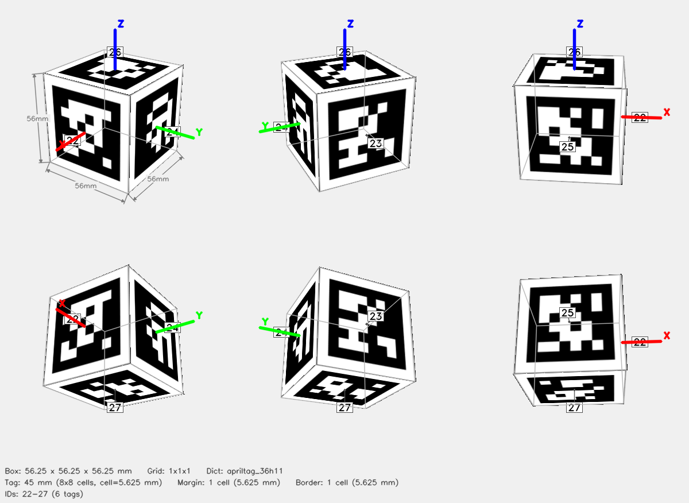

# ArUco Cube — 1x1x1



## Parameters

| Parameter | Value |
|-----------|-------|
| Dictionary | `apriltag_36h11` |
| Grid | 1x1x1 (X x Y x Z tags) |
| Box dimensions | 56.25 x 56.25 x 56.25 mm |
| Tag size | 45 mm (8x8 cells) |
| Cell size | 5.625 mm |
| Margin | 1 cell (5.625 mm) |
| Border | 1 cell (5.625 mm) |
| Total tags | 6 |
| Tag IDs | 22–27 |

## Face Layout

| Face | Tag IDs |
|------|---------|
| +X | 22 |
| -X | 23 |
| +Y | 24 |
| -Y | 25 |
| +Z | 26 |
| -Z | 27 |

## Files

| File | Description |
|------|-------------|
| `cube.3mf` | Multi-color 3MF for Bambu Studio |
| `config.json` | Detector config (used by `detect_cube.py`) |
| `thumbnail.png` | 6-view preview |
| `mujoco/cube.xml` | MuJoCo MJCF model |
| `mujoco/cube.obj` | Wavefront OBJ mesh (UV-mapped) |
| `mujoco/cube.mtl` | OBJ material file |
| `mujoco/cube_atlas.png` | Texture atlas |

## Config JSON

```json
{
  "dict": "apriltag_36h11",
  "grid": "1x1x1",
  "tag_ids": [
    22,
    23,
    24,
    25,
    26,
    27
  ],
  "faces": {
    "+X": [
      22
    ],
    "-X": [
      23
    ],
    "+Y": [
      24
    ],
    "-Y": [
      25
    ],
    "+Z": [
      26
    ],
    "-Z": [
      27
    ]
  },
  "tag_size_mm": 45.0,
  "cell_size_mm": 5.625,
  "margin_cells": 1,
  "border_cells": 1,
  "marker_pixels": 8,
  "box_dims": [
    56.25,
    56.25,
    56.25
  ]
}
```

## Regenerate

```bash
python generate_cube.py --grid 1x1x1 --dict apriltag_36h11 --tag-size 45 --margin-cell 1 --border-cell 1 -o rg2_cube_3
```
